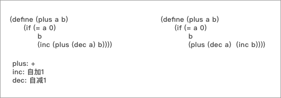
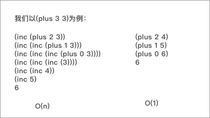
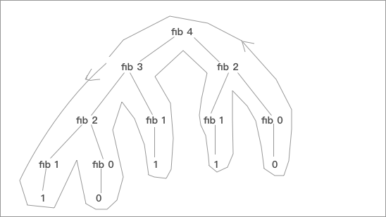
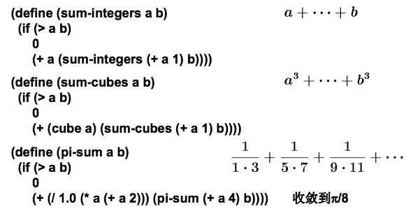
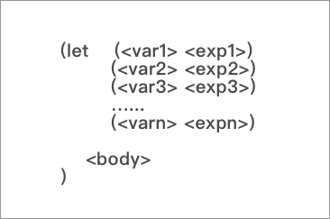

## 过程的求值计算

这里面我们先来介绍一种最为简单、通用的求值模型，`代换模型`并不能概括全部的求值方式，但是我们先从这个开始。

### 代换模型

通用的表达式计算模式，描述起来其实非常简单，先求出各子表达式的值，找到要调用的过程的定义，用求出的实际参数代换过程体里的形式参数，再对过程体进行求值，本质上一种使用等价性的表达式的拆分机制，比如下例，是对一个平方和函数进行计算的详细步骤：

```lisp
(define (sum-of-squares x y)  
			(+ (square x) (square y)))
; sum-of-squares 求两个数的平方和
(define (f x) (sum-of-squares (+ x 1) (* x 2)))
(f 5) 
(sum-of-squares (+ 5 1) (* 5 2)) ; 注意这两行，首先算出来形参
(+ (square 6) (square 10)) 
(+ (* 6 6) (* 10 10))
(+ 36 100)
136
```

> Tips: 上面的代换方式又被称作`应用序`的计算方式，这也是 Scheme 解释器的计算方式，除此之外，还有一种被称作`正则序`的计算方式，正则性和上面不一样的地方在于，它不会先计算出调用过程的形参，反倒是一定要把整个表达式最小化到所有的东西都能直接计算的程序(摊开了的感觉):
>
> ```lisp
> (f 5) 
> (sum-of-squares (+ 5 1) (* 5 2))
> (+ (square (+ 5 1)) (square (* 5 2)) ); 注意这两行这里没往下计算形参
> (+ (* (+ 5 1) (+ 5 1)) (* (* 5 2) (* 5 2)))
> (+ (* 6 6) (* 10 10)) ; 反倒是都摊开了才开始进行规约
> (+ 36 100)
> 136
> ```
>
> PS: 有个很简单的Demo能证明所用的解释器到底用了什么计算顺序:
>
> ```lisp
> (define (p) (p))
> (define (test x y)
>   (if (= x 0)
>       0
>       y))
> ```
>
> 大家可以想想`正则序`和`应用序`分别会有什么结果。

### 迭代与递归

我们首先从两个简单例子开始：



图中有两个简单的例子，计算上是等价的都是对a、b进行相加的等价型(这里使用`plus`是为了区别基本符号)，但是我们活学活用一下刚才学过的代换模型的知识就会发现，这两个过程的计算方式是不同的：



这里我们抛开别的我们很明显就能发现，这两种计算方式计算过程的图形长得就不一样，`方案1`里面层层代换之后表达式越来越长，最后开始规约。但是`方案2`就没有这个过程，每次都是单一的一步层层调用，这样的话实现这两种算法的时间复杂度就天差地别，`方案1`是一个`O(n)`的计算方式，层层递归的展开。而`方案2`的调用是线性次数的迭代，时间复杂度就是`O(1)`的。

这里我们就称第一种求值方式是`线性递归`，第二种方式是`线性迭代`。

> Tips: 这一节的递归和迭代和我们在其余编程语言里学习的有所区别。这里面说的是计算方式，而非语法实现，如果从语法角度来讲这两个都调用了自己都是`语法递归`。
> 计算的`线性递归`的低效还体现在中间结果存储需要空间，整体形成一个较大的运行栈。而`线性迭代`的中间结果只是中间结果的数值和计数器数值，当计算机掉电后也容易恢复，可以在计算中任何一步中断和重启。

### 树形结构

说起树形结构我们先举一个例子，斐波那契数列：
$$
  
Fib(n) =  
        \begin{cases}  
        0,  & \text{n = 0 } \\\\ 
        n, & \text{n = 1} \\\\  
        Fib(n-1) + Fib(n-2), & \text{others}    
        \end{cases}
$$

这是斐波那契数列的规则定义，我们也经常用这个方式去使用递归编写代码，简单的写成 Scheme 的样子呢应该就是下面这个样子:

```lisp
(define (Fib x) 
  	(if (< N 2)
        N
        (+ (Fib (- N 1)) (Fib (- N 2))))
```

按照我们之前的步骤去分析整个过程的求值过程，能画出这样的一个树形的图：



这个过程是非常低效的，从图中有非常多重复的计算过程，比如`Fib 2` ,`Fib1`都计算了两次，并且斐波那契的时间复杂度是指数级的，这个重复会随着计算数据的增大而继续的增大。

如何优化？

我们看到之前的`线性迭代`提到了只保存了**中间结果的数值和计数器数值**，我们可以借助这个思路去优化我们的斐波那契数列。

我们使用`a`，`b`两个变量保存中间结果，斐波那契数列是`Fib(0)=0`，`Fib(1)=1`，其余等于前两个数之和，所以首先给a／b赋值为1, 之后：
$$
a\Leftarrow a + b\\\\
b\Leftarrow a
$$
这样反复的迭代下去，最后`a`，`b`就会保存最终结果`Fib(n+1)`，`Fib(n)`。

写成代码的形式是这样的：

```lisp
(define (fib n)
  (define (fib-iter a b count)
    (if (= count 0))
    	b
    	(fib-iter (+ a b) a (- count 1)))
  (fib-iter 1 0 n)
  )
```

这样一个树形的递归就会变成一个常数时间的线性的线性迭代。

> „ Tips: 尾递归形式和尾递归优化
>
> - ‰一个递归定义的过程称为是尾递归的，如果其中对本过程的递归调用都是过程**执行的最后一个表达式**
> - 虽然是递归定义过程，计算所需的存储却不随递归深度增加。尾递归技术就是重复使用原过程在执行栈里的存储，不另行分配

### 实例求值

PS: 增长的阶 => Big O 分析法
$$
O(1) < O(log n) < O(n) < O(n log n) < O(n^2) < O(n^3) < ... < O(2^n) \\\\
常量\qquad 对数\qquad 线性\qquad 平方\qquad\qquad 立方\qquad \qquad\qquad\qquad指数\qquad
$$
Example:

* 幂运算：求`b`的`n`次幂

$$
b{^n} = b * b ^{n-1} \\\\
b^0 = 1
$$

``` lisp
; 线性递归方式 O(n)的时间复杂度 O(n)的空间复杂度
(define (expt b n)
  (if (= n 0) 
      1
      (expt b n - 1)))
; 线性迭代方式 O(n) 的时间复杂度 O(1)的空间复杂度
 (define (expt b n)
  (expt-iter b n 1))

 (define (expt-iter b n result)
   (if (= n 0)
       result
       (expt-iter b (- n 1) (* result b)))) 
```

 二分法 O(log(n))的时间复杂度:
$$
b^n = (b^{n/2})  \text {   n为偶数}\\\\
b^n = b*b^{n-1} \text   {  n为奇数}
$$

``` lisp
(define (fast-expt b n) 
  (cond ((= n 0) 1)
    	((even? n) (square (fast-expt b (/ n 2))))
    	(else (* b (fast-expt b (- n 1))))))
```

* 最大公约数:

欧几里得原理的 Scheme 描述，算法的增长阶:

``` lisp
(define (GCD a b)
  ((if (= b 0)
       a
       (GCD b (reminder a b)))))
```

* 素性检测：

通常的素性检测，是检测是否有小于 $ \sqrt{n} $ 的素数，这是一个 $ ch $ 的算法。

费马检查提供了$ O(log(n)) $ 的计算方式：
$$
a^n \equiv  a \mod n
$$
取任意`a < n`，代入公式求`a^n mod n`等不等于`n`。如果等于，就有可能是素数，但是如果不是肯定不是素数，然后不断的取随机数进行`概率检测`增加素性测试的概率。

``` lisp
(define (fermat-test n)
  (define (try-it a)
    (= (expmod a n n) a)
  (try-it (+ 1 (random (- n 1))))))

(define (fast-prime? n times)
  (cond (fermat-test n) (fast-prime n (- times 1)))
  		(else false)))
```

使用了概率测试，提高了求素数的概率，能骗过`费马检测`的数字特别少可以忽略不计。

## 高阶函数抽象

我们从之前的学习中能看出，过程也是一类抽象，不依赖特定的数字，却能描述数之间的相互关系：

``` lisp
(define (cube x) (* x x x))
```

但是如果一个过程只能传入数，那过程抽象的描述能力显然要大打折扣，我们之前也已经说过了，数据和过程的界限将变得越来越模糊，这样子我们的过程不但能当成参数传入还能当成参数返回，还拥有$ \lambda $ 表达式这样拥有匿名和闭包特性的高阶应用。

我们在这样的一下情况下需要用到高阶过程：

* ‰ 一些计算具有相似的模式，只是其中涉及的几个操作不同
* 要利用公共模式需要把这几个操作参数化
* 具有参数化操作的过程，就是高阶过程(一种)

 ### 过程作为参数

我们来先看这几个计算过程，都是很简单的过程：



我们能很容易的在这三个累加式中找到共性，他们的区别是每个item的构成不同，但是组合方式都是对`a,b`进行操作，而且从整体来看都是每个item的累加，这样我们就能从中抽象出一个通式：

``` lisp
(define (<name> a b)
  ((if (> a b)
       0
       (+ (<term> a)
          (<name> (<next> a) b))))  
```

这其中`<name>`代表了函数名，`<term>`代表了对`a`进行的操作，`<next>` 代表了一种改变参数的步进，计算了下一步的a的值。

这时候我们发现我们对a的操作`<term>`和`<next>`已经被抽象了出来，如果这两个过程能被当成参数传入，那么这样的通式就能很好的概括上面三个计算公式的过程了，恰好 Scheme 就支持以过程作为参数，我们做累加的的这段代码就可以这样写：

``` lisp
; next 的步进
(define (next x) (+ x 1))
; term 
(define (term x) x)
; 通式
(define (sum term a next b)
  (if (> a b)
      0
      (+ (term a) (sum (next a) b))))
; 累加的包装
(define (sum-integers a b)
  (sum term a next b))
```

通过这样的一个特性支持的高阶函数，我们就非常轻易的解决了之前那些的冗余的代码，将一个迭代累加的过程抽象成了一个通式，只需要传入过程就好了。

> C 语言等传统语言是无法传递过程的，但是可以传递函数指针，完成类似的效果，
>
> C里面让结构体包含过程就是通过结构体携带函数指针来完成的。
>
> ``` c
> typedef double (*add) (int); // 函数名和类型
> ```

###  $ \lambda $ 的构造

上一小节里面我们做出来一个累加的通式，为了好理解我是把好几个函数分开定义的，但是我们之前知道，子国策和国内的定义可以写在过程内，就像这样：

``` lisp
(define (sum-integers a b)
  (define (next x) (+ x 1))
  (define (term x) x)
  (sum term a next b)
  )
```

写成这样，子过程的安全性和可达性都得到了保证，但是我们不禁要问，`next`和`term`这两个变量真有用么？我们只是把他们创建出来就扔进了`sum`过程，之后他们就再没什么用了，这时候我们就应该引入$ \lambda $表达式，使用过函数式语言的同学对这个应该不会陌生：

``` lisp
; 比如刚才的 next 就可以写成这种形式
(lambda (x) (+ x 1))
```

$ \lambda $ 表达式的语法是这样的：


$ \lambda $ 表达式提供了这样的一个匿名的过程，这时候我们再写这个累加函数的时候就可以写成这个样子的了：

``` lisp
(define (sum-intergers a b)
  (sum 
   (lambda (x) (+ x 1)
   a
   (lambda (x) x
   b))
```

是不是方便了很多。

> Tips: lambda 表达式的求值
>
> 之前我们学过 Scheme 应用序的求值顺序，会先对函数的参数进行求值
>
> 但是 lambda 是一个特殊的过程，参数不参与求值

还有：

> Tips: lambda 创建的是对象，只不过也同样是过程而已
>
> 和`define`创建的过程还是有所区别的，但是因为是过程，所以可以当作组合子
>
> 的运算符来用。

### 使用`let`创建局部变量

另外 $ \lambda $ 表达式还提供了使用`let`创建局部变量的方法：

我们有的时候程序需要一些中间变量，虽然也能用`define`去定义，但是`define`最好还是用来定义内部过程比较好。

还有就是通过定义一个辅助的子过程去代理这个中间变量，但是面对更复杂的情况，会使得代码结构不清晰。

SICP上的一个例子：
$$
f(x,y) = x(1 + xy)^2 + y (1-y) + (1 + xy)(1-y)
$$
我们希望能将这个式子简化，里面的重复步骤实在是太多了，如果全都直接写出来肯定很坑的会被计算好几次，我们可以把这个简写成这样：
$$
a = 1 + xy\\\\
b = 1-y\\\\
f(x,y) = xa^2 + yb + ab
$$
这时候我们就需要抽象出`a`,`b`这两个变量，我们这时候就可以引入`let`表达式：



`let` 表达式可以提供多个类似键值对的局部变量，可见性仅在这个let表达式内，可以应用在下面的`body`中。

``` lisp
(define (f x y)
  (let ((a (+ 1 (* x y)))
        (b (- 1 y)))
       (+ (* x (square a))
          (* y b)
          (* a b))))
```

`let`表达式具有这样的一些特性：

* let 尽可能在接近使用的地方创建局部变量约束。
* let也同样会有变量覆盖的情况出现。


### 过程作为返回值

回到我们最开始的求平方根的问题，我们已经知道了求一个数的平方根等价于求：
$$
f(y) = x/y
$$
的一个不动点，我们可以很轻松的写出这样的代码：

``` lisp
(define (sqrt x)
	(fixed-point (lambda (y) (/ x y)) 1.0 )) 
; fixed-point 那一套之前已经太熟悉了，就是调用传入的过程，不断看数据的趋近是否小于某个参量
```

但是这样子的式子是明显没办法正常收敛的，我们不过就是在反复的尝试两个数字而已。这时我们在上一节里面的那个办法的作用就体现出来了，还记得么？我们使用了:
$$
x_2 = (x_1 + f(x1) )/2
$$
作为下一次使用的变量传入，然后再通过不断的迭代直到最后的结果收敛到一个固定的值求得不动点。

这种通过平均值来解决函数呈现波动趋势的方法被叫做`平均阻尼法` ，通过这种平均阻尼的逼近方法我们可以把上面的那个代码改变一下，这样不动点就可以正常的逼近了：

``` lisp
(define (sqrt x)
  (fixed-point) (lambda (y) (average y (/ x y))
                        1.0))
```

我们现在已经把里面的传入的过程换成了我们所使用的平均阻尼的方法了，但是这样的过程明显是不能满足我们的，我们假定SICP这章主要谈的是有关过程抽象的话题（实际上也是这样），其实平方根的话题只是个不错的引子。

其实这里面出现的问题就是里面的方法又不具备通用性了，我们之前也说了`平均阻尼`是一类解决逼近问题的通用方法，单就求不动点的函数来说，也可以针对各种的过程使用平均阻尼的方法的。这时候我们就希望语言可以给予我们生成方法的方法，这样我们只需要传入需要进行平均阻尼加工的方法就可以，我们就可以直接使用平均阻尼来求不动点了，当然 Scheme 自然提供了这种方法，我们可以把刚才描述的的表达式写成这种样子：

``` lisp
(define (average-damp f)
	(lambda (x) (average x (f x))))
```

这里我们只需要传入一个方法，就可以生成对应的平均阻尼方法了，比如我们想求`cos`函数的不动点，我们就可以写`(average-damp cos)`就可以了，这个过程的参数是过程，返回值也是一个过程，但是经过我们之前对 Scheme 的理解，对于这种方式一点都不感觉惊奇。事实上在计算中生成新过程是前面没遇到过的新问题，实际上这是lambda 表达式最重要的作用。

> Tips: 作为一等公民的过程：
>
> * 可以用变量命名（在常规语言里，可存入变量，取出使用）
> * ‰可以作为参数传给过程
> * 可以由过程作为结果返回
> * 可以放入各种数据结构
> * 可以在运行中动态地构造

## 总结

这一章我们接触了很多相对基础的知识，从一个求函数平方根(不动点)的问题为核心，我们接触了 Scheme 的基础语法，讨论语言的数值计算问题，甚至还谈到了高阶过程（lambda表达式、Lisp 语言中过程的第一地位），这些都是和传统的 OO 语言有很大的区别的，甚至说思想都可以说是这种函数式语言的一个核心观点了。我的学习路径一直都很诡异，很多的理论接触之前就不小心做过一些实践，其实有的时候这样对知识的把握是不牢靠的。SICP这本书看起来很简单，但是我觉得还是应该仔细的阅读，毕竟能把很多思想核心的问题说的如此的浅显易懂还是很看原书作者功底的。